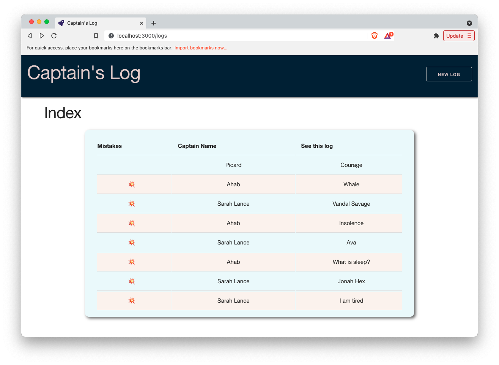
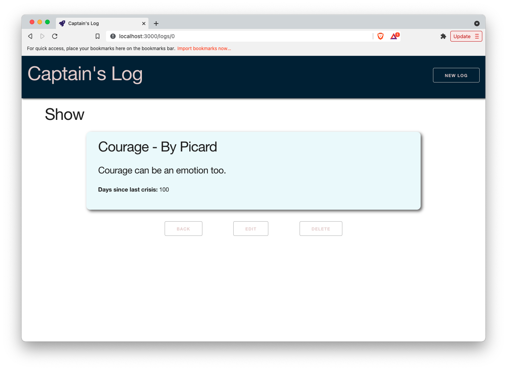
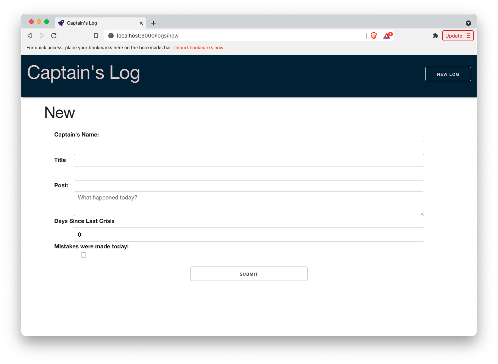
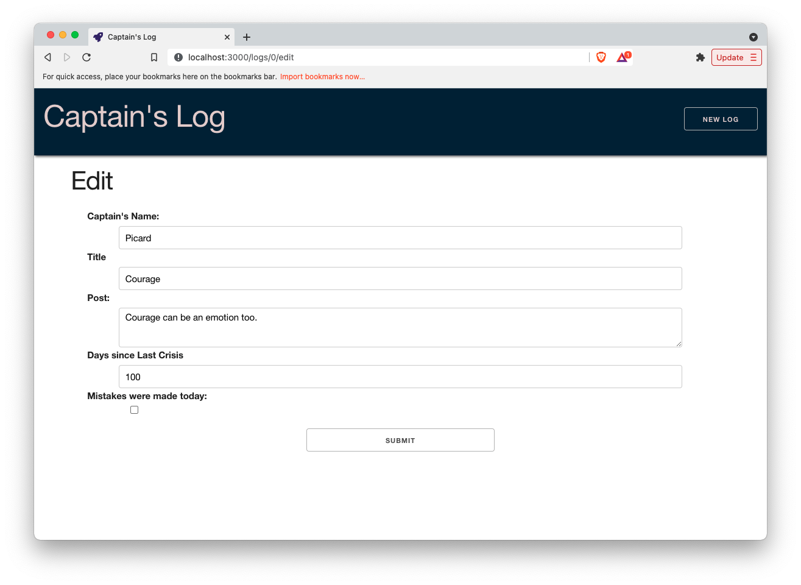

[](https://pursuit.org)

# Captain's Log Front-End

## Getting Started

- Fork this repo
- Clone the forked repository
- `cd` to the directory where you cloned it
- `npm install` to install dependencies
- `npm start` to start the react app on `localhost:3000`
- `npm test` (in a separate terminal tab) to open the cypress testing window (keep your react app runnign as well)

> _Note_: Remember to `git add`, `git commit` and `git push` regularly

Using the [Captain's Log API that you built](https://github.com/joinpursuit/captains-log), you are going to create a frontend-only app.

Don't forget to keep your back-end API running during this build.

### User Stories

Use these user stories to build your app
- A user sees a welcome page with a nav bar
- The nav bar is visible on all pages and can navigate to an index of all logs and a form for a new log
- A user can see a list of all the logs
- A user can click on a specific log and see more details
- A user can update a log using a form
- A user can delete a log through a button on the show page

### Build the Following Frontend Components/Pages/Routes

### Nav Bar

At the top of your app you should have a navigation bar.

- It displays links to each primary route (`/logs`, `/logs/new`) at the top of the page.

Your app should also include the following routes:

<hr />

### INDEX: GET `/logs`

- Displays a list of `log.title` that are clickable to take the user to `/logs/:index`.

**IMPORTANT**

Make sure your first logs are the ones shared in [captain's log API](https://github.com/joinpursuit/captains-log)

Starting with:

```js
module.exports = [
  {
    captainName: "Picard",
    title: "Courage",
    post: "Courage can be an emotion too.",
    mistakesWereMadeToday: true,
    daysSinceLastCrisis: 100,
  },
  {
    captainName: "Ahab",
    title: "Whale",
    post: "By heavens man, we are turned round and round in this world, like yonder windlass, and fate is the handspike.",
    mistakesWereMadeToday: true,
    daysSinceLastCrisis: 20,
  },
  {
    captainName: "Sarah Lance",
    title: "Vandal Savage",
    post: "I’d tell you to go to hell, but you’d probably just feel at home there.",
    mistakesWereMadeToday: true,
    daysSinceLastCrisis: 0,
  },
  {
    captainName: "Ahab",
    title: "Insolence",
    post: "I don't give reasons. I give orders!",
    mistakesWereMadeToday: true,
    daysSinceLastCrisis: 100,
  },
  {
    captainName: "Sarah Lance",
    title: "Ava",
    post: "Ava's the kind of girl that you take home to your parents, and I am the kind you take to an exorcism",
    mistakesWereMadeToday: true,
    daysSinceLastCrisis: 0,
  },
  {
    captainName: "Ahab",
    title: "What is sleep?",
    post: "Sleep? That bed is a coffin, and those are winding sheets. I do not sleep, I die.",
    mistakesWereMadeToday: true,
    daysSinceLastCrisis: 5,
  },
  {
    captainName: "Sarah Lance",
    title: "Jonah Hex",
    post: "I know you don’t like taking orders from a woman, but you’re gonna like getting your ass kicked by one even less.",
    mistakesWereMadeToday: true,
    daysSinceLastCrisis: 0,
  },
];
```

Or else your test(s) will not pass

### SHOW: GET `/logs/:index`

- Displays the details of each log
  - captainName
  - title
  - post
  - mistakesWereMadeToday
  - daysSinceLastCrisis
- Displays two buttons
  - <kbd>back</kbd>, takes the user back to the `/logs` index view
  - <kbd>delete</kbd>, deletes the log and takes the user back to the `/logs` index view

### NEW:  GET `/logs/new`

- Displays a form with the following inputs and appropriate labels:
  - captainName (text)
  - title (text)
  - post (text)
  - mistakesWereMadeToday (checkbox)
  - daysSinceLastCrisis (number)
  - submit (submit)


### Edit: GET `/logs/:index/edit`

- Add an edit route
- Add an edit form that is prefilled with the log to edit

### Your App Should Rely on the following Backend routes from the Captains Log API Lab:

### INDEX: GET `/logs`
- Your Index page uses this route to display a list of all logs

### SHOW: GET `/logs/:index`
- Your Show page uses this route to display details for a single log

### Create POST `/logs`
- Your New form uses this route to create a new log

### Update: PUT `/logs/:index`
- Your Update form uses this route to update a log

### Delete: DELETE `/logs/:index`
- Your show page provides a button that uses this route to delete a log


### Add Basic CSS Styling

Add some style to improve the UX/UI of your app

### App Styling Inspiration









### Bonuses

- Use react-bootstrap
- Use react-transition-group to transition between pages [Demo](https://reactrouter.com/web/example/animated-transitions)
- Add a 404 page
- Add functionality that when a user presses the delete button a confirmation appears first
- Add sort functionality to allow sorting by captain name or by days since last crisis
- Add filter functionality to see all logs, logs where mistakes were made, logs where mistakes were not made
- Deploy this app online and add it to your portfolio
